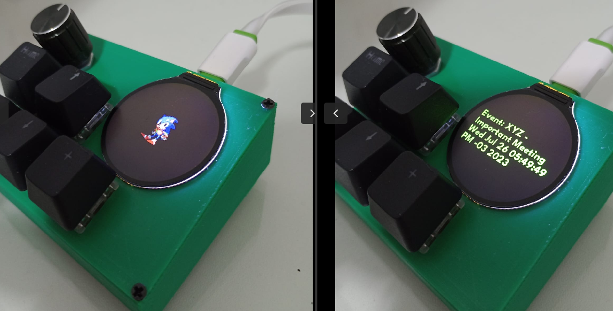

# MakroBuddy

This Git repository provides step-by-step instructions and code samples for building your own MakroBuddy using the Raspberry Pi Pico microcontroller board. A macropad is a programmable keypad with customizable buttons that can be used to automate tasks, streamline workflows, or enhance productivity.

### Why it's called MakroBuddy?
Besides offering convenient hot-keys, MakroBuddy can also serve as a helpful **reminder** for important events displayed on your screen. Moreover, it brings captivating animated sprites that will be your delightful companions throughout the day ❤️.



For this project I'm using a board from [Waveshare](https://www.waveshare.com/rp2040-lcd-1.28.htm) (RP2040 MCU Board, With 1.28inch Round LCD). It uses a raspberry pi pico (rp2040) as its microcontroler, so it's possible to build a HID (Human Interface Device). In this repository, you'll discover a convenient housing specifically designed for this project. It includes designated spots for the Waveshare board, rotary encoder, and mechanical switches, ensuring a clean and organized assembly.

## Running Example

When no important messages are present, the screen showcases a delightful random sprite animation, fully configurable to your liking. If you want to know more click [here](./ADD_MORE_SPRITES.md).

See the full video:
[](https://www.youtube.com/shorts/jeDKUlj0tqM)


## How it gets the notifications/events?

The board doesn't have any wifi/network capability, so...

As a devoted [dunst](https://github.com/dunst-project/dunst) user, I realized I could leverage its event-intercepting capabilities to enhance my workflow. You can find more about this feature [here](https://wiki.archlinux.org/title/Dunst#Scripting).

Essentially, the idea is to configure dunst to trigger this [script](./dunst-to-file/notify.sh) here whenever a specific event occurs. This script sends the relevant data to the `CIRCUITPY` mount point. 

The only drawback is that you need to manually mount the `CIRCUITPY` folder every time you plug or unplug the device. I am aware that other methods, like serial communication, could be used to send data through USB, but I preferred this approach for simplicity and ease of use.

If you choose to follow the same approach as I did, configuring your dunst is straightforward. Just follow these steps:

```
[all]
summary = "*"
script = /path/to/the/dunst-to-file/notify.sh
```

The truly remarkable aspect of dunst is its flexibility. By exploring the official documentation, you'll discover the ability to customize any event and link it to your desired script. This empowers you to avoid the hassle of having all notifications displayed, tailoring your notification experience to perfection.

## Bill of materials
- [Raspberry Pi-RP2040 Development Board](https://pt.aliexpress.com/item/1005004616586355.html?spm=a2g0o.order_list.order_list_main.21.21efcaa4GvI4NZ&gatewayAdapt=glo2bra).
- [Rotary Encoder](https://pt.aliexpress.com/item/4001112405456.html?spm=a2g0o.order_list.order_list_main.337.56c2caa4j3XZvl&gatewayAdapt=glo2bra).
- Any mechanical [switch](https://pt.aliexpress.com/item/1005004285463567.html?spm=a2g0o.productlist.main.15.7c3823b2lCL06c&algo_pvid=f50a2a66-7073-4be2-a435-df6fec2686b5&algo_exp_id=f50a2a66-7073-4be2-a435-df6fec2686b5-7&pdp_npi=3%40dis%21BRL%2165.37%2132.69%21%21%2112.66%21%21%40212244c416888441242025140d0779%2112000028629113466%21sea%21BR%21172919556&curPageLogUid=xjMCfauOfAiu) compatible with MX Cherry should work.
- Some wires.
- Hot glue (to keep the wires on the waveshare board, since I don't have some male 1.27 pins).
- Soldering iron.
- 3d printed housing  (you can use the one that I've built [here](https://www.tinkercad.com/things/47IuxGAQAh5)).
- If, for any reason, your LCD screen gets damaged, there's a convenient option to replace just the display on the Waveshare board. I encountered this situation and successfully replaced it with [this](https://www.aliexpress.com/item/1005002525190127.html?spm=a2g0o.order_list.order_list_main.11.5c971802Mmtqq3) compatible display. Make sure to select the 'bare screen' option for the replacement.

## Hardware assembly guide

### Rotary Encoder
To ensure proper connectivity and functionality, it is recommended to refer to the following schematics. While you have the flexibility to choose which GPIO ports to utilize, please note that updating the code accordingly is essential for seamless operation.


### Mechanical Switches


### Real footage


- The black wire is connected to the GND pin on the left header of the Waveshare board. This single black wire serves as the common ground connection for all the other switches.
- The colored wires originating from the left header of the Waveshare board are individually connected to the GPX ports and then connected to the corresponding switch pins.
- The wires from the rotary encoder are connected to the right header of the waveshare board.
- As you can noticed there are some hot glues to keep the wires steady on both left and right headers. I had to cut the wire a little bit, solder it a little and force to enter on each pin that I wanted. Remember, those pins are only 1.27mm.

Waveshare board offers a lot of pins as we can see here:


## Firmware setup guide
- I've used CircuitPython from Adafruit as the firmware, you **must** follow [this](https://learn.adafruit.com/welcome-to-circuitpython?view=all#download-the-latest-version-2977908) guide before push our code into it. Basically, we have to 'prepare' our board with a proper firmware before push the code into it and make it executable.

## Install our code
- Clone this git repository.
- Connect your board on a USB port.
- Copy the `lib/`, `sprites/`, `main.py` and `boot_out.txt` file into the `CIRCUITPY` volume (mount point).

That's it! Feel free to modify the python code, by default, I'm using the home key and the arrow keys and the rotary encoder as a volume controller (media controls).


## How to test it locally without the raspberry pi pico hardware?

If you want to take advantage of some Raspberry Pi Pico emulators available, one great option is [rp2040js](https://github.com/wokwi/rp2040js). With this emulator, I can view the output of my `main.py` without the need to upload the code to the hardware. 

Of course, you won't see the images displayed on the physical screen, but using this method can be helpful for testing or writing unit tests.

### Instructions

I've created a small Docker wrapper for the rp2040js project to simplify the execution of commands. But all the steps are described in the official documentation of the [`rp2040js`](https://github.com/wokwi/rp2040js) project

```bash
cd rp2040-emulator/
./build.sh
docker-compose build
docker-compose up --detach

# enter on container.
docker-compose exec rp2040 bash

# inside the container.
npm run start:circuitpython
```

You can press `CTRL+X` to exit the REPL and `exit` to quit the container. If you make any changes to your code, simply `./build.sh` and repeat the process to run the emulator once more (`npm run start:circuitpython`).

## References
- https://learn.adafruit.com/diy-pico-mechanical-keyboard-with-fritzing-circuitpython/code-the-pico-keyboard
- https://learn.adafruit.com/rotary-encoder/hardware
- https://www.waveshare.com/rp2040-lcd-1.28.htm
- https://github.com/wokwi/rp2040js
- https://raspberrypi.stackexchange.com/questions/136825/emulator-for-rp2040
- https://learn.adafruit.com/circuitpython-display_text-library/overview

Feel free to modify and personalize according to your specific project and goals. Good luck with your macropad build!
